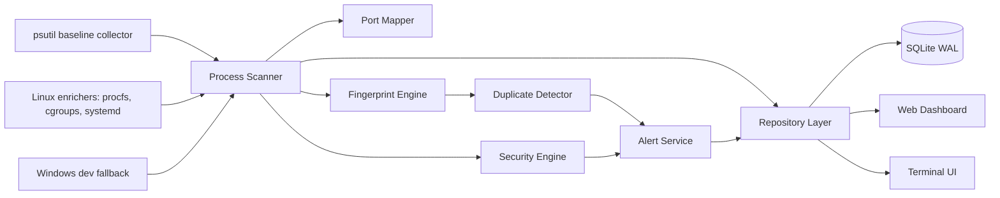

# ProcSentry

<div align="center">

### Lightweight process intelligence for Linux VPS operators

Find duplicate apps, suspicious processes, exposed ports, restart loops, and
resource-heavy services without installing a giant monitoring stack.

<br>

[](#project-status)
[](https://www.python.org/)
[](#linux-first-design)
[](#performance-philosophy)
[](#dashboard-overview)

<br>

```text
processes -> fingerprints -> duplicate intelligence -> alerts -> dashboard / TUI
```

</div>

---

## What Is ProcSentry?

ProcSentry is a **Linux-first VPS observability tool** focused on process
intelligence.

It helps answer practical server questions:

| Question | ProcSentry helps with |
| --- | --- |
| Why is my VPS slow? | CPU/RAM process tracking |
| Did I accidentally start the same app twice? | duplicate process detection |
| What is listening on this port? | port-to-process mapping |
| Is this process suspicious? | lightweight security heuristics |
| Is this process managed or manual? | systemd/cgroup/container hints |
| Did this service keep restarting? | restart-count and restart-loop signals |

ProcSentry is not trying to replace Prometheus, Grafana, or a full SIEM. It is
the smaller tool you reach for when you want to understand **what is actually
running on one Linux box**.

> **Project status:** deployable alpha. The project is suitable for real
> Ubuntu/Debian VPS validation. Keep the dashboard local or protected, and review
> findings manually before taking action.

---

## Feature Highlights

| Area | Capabilities |
| --- | --- |
| Process monitoring | PID, parent PID, command, cwd, executable, user, CPU, RAM, threads, status |
| Duplicate intelligence | exact/fuzzy detection, confidence scoring, structured reasoning |
| Low false positives | worker-aware exclusions for gunicorn, celery, nginx, postgres, pm2, uvicorn reload, node clusters, docker shims |
| Linux intelligence | procfs, cgroups, systemd units, containers, deleted executables, zombies, orphans |
| Port mapping | listening TCP/UDP ports mapped to owning processes |
| Suspicious process detection | temp executables, deleted binaries, miner patterns, reverse-shell patterns, suspicious ports |
| Restart awareness | PID reuse and restart counters |
| Runtime observability | scan timing, cache stats, DB size, capability state |
| Web dashboard | FastAPI, HTMX, Jinja2, Tailwind |
| Terminal UI | Textual/Rich live process view |
| Platform-aware collectors | Linux production collectors, Windows-safe development fallback |

---

## Screenshots

Screenshots are placeholders until the first tagged alpha UI pass. The paths are
ready for real captures.

| View | Placeholder |
| --- | --- |
| Dashboard overview | `docs/screenshots/dashboard-overview.png` |
| Duplicate review | `docs/screenshots/duplicate-review.png` |
| Suspicious process review | `docs/screenshots/suspicious-processes.png` |
| Process detail | `docs/screenshots/process-detail.png` |
| Terminal UI | `docs/screenshots/terminal-ui.png` |

```md


```

---

## Why This Exists

Small VPSes get messy fast:

- a Python app started by hand during debugging
- a `uvicorn --reload` process left running
- a deploy script that launched the same worker twice
- a public port that should only be local
- a container shim hiding the real app process
- a suspicious binary sitting in `/tmp`

Generic metrics dashboards can show CPU and memory. ProcSentry tries to explain
process intent.

### Why Duplicate Detection Matters

Accidental duplicate processes can:

- waste RAM on small VPSes
- process the same jobs twice
- create confusing port conflicts
- hide failed deploys
- make incident response harder

ProcSentry uses fingerprints, ancestry, service context, and confidence scoring
to avoid shouting about normal worker pools.

### Why Lightweight Observability Matters

Many VPS users do not want a full metrics stack for a small server. ProcSentry is
designed to be useful without becoming the heaviest service on the box.

---

## Architecture



### Process Flow

```text
collect process snapshot
  -> attach ports and outbound connection counts
  -> enrich with Linux metadata
  -> normalize command line
  -> generate fingerprints
  -> score duplicate candidates
  -> score suspicious behavior
  -> persist current state + sampled history
  -> update API, dashboard, and terminal UI
```

### Component Map

| Component | Role |
| --- | --- |
| `collectors/common` | psutil baseline collection, platform capability detection |
| `collectors/linux` | procfs, cgroup, systemd, container, zombie, deleted-exe enrichment |
| `collectors/windows` | safe development fallback on Windows |
| `core/fingerprint.py` | exact and fuzzy process fingerprints |
| `core/duplicate_detector.py` | duplicate scoring, worker exclusions, restart-loop suppression |
| `core/security_engine.py` | suspicious process scoring |
| `database/repository.py` | SQLite persistence, retention, WAL maintenance |
| `web/` | FastAPI + HTMX dashboard |
| `tui/` | Textual/Rich terminal interface |

---

## Install

### Ubuntu / Debian

```bash
sudo apt-get update
sudo apt-get install -y python3.12 python3.12-venv sqlite3

git clone https://github.com/your-org/procsentry.git
cd procsentry

python3.12 -m venv .venv
. .venv/bin/activate
pip install -e ".[dev]"

procsentry --config config/procsentry.yml scan-once
```

Run the web dashboard:

```bash
procsentry --config config/procsentry.yml web
```

Open:

```text
http://127.0.0.1:8080
```

Run the terminal UI:

```bash
procsentry --config config/procsentry.yml tui
```

Run the daemon:

```bash
procsentry --config config/production.example.yml daemon
```

Full deployment notes:

```text
docs/deployment-linux.md
```

### Docker

```bash
docker compose up --build
```

Docker is useful for validation. For best host process visibility on a VPS, a
native systemd install is usually clearer.

### Development

```bash
python -m venv .venv
. .venv/bin/activate
pip install -e ".[dev]"
python -m pytest
```

Windows development is supported for the UI, API, database layer, and detection
logic. Linux-only process intelligence degrades safely.

---

## Quick Start

Run one scan:

```bash
procsentry --config config/procsentry.yml scan-once
```

Benchmark scanner overhead:

```bash
python scripts/benchmark_scan.py --iterations 20 --sleep 1
```

Check health:

```bash
curl http://127.0.0.1:8080/health
curl http://127.0.0.1:8080/metrics
curl http://127.0.0.1:8080/capabilities
```

Access a remote VPS dashboard safely:

```bash
ssh -L 8080:127.0.0.1:8080 root@your-vps
```

---

## Example Workflows

### Duplicate Review

```text
Duplicate group
Confidence: 94%

Reason:
- same executable alias
- same or highly similar cwd
- 96% argument similarity
- same application entrypoint

PIDs:
- 1842 python3 /srv/bot/bot.py
- 1910 python3 /srv/bot/bot.py
```

ProcSentry tries not to flag intentional process groups:

- gunicorn workers
- celery prefork workers
- nginx workers
- postgres background workers
- `uvicorn --reload` subprocesses
- node cluster workers
- docker/containerd shim trees

### Suspicious Process Review

```text
WARNING security / CRITICAL
PID 4242 (xmrig) looks suspicious:
- known crypto miner process name
- excessive CPU
- temp directory executable
```

### Port Exposure Review

```text
0.0.0.0:8000    tcp    uvicorn    PID 1832
127.0.0.1:5432  tcp    postgres   PID 912
```

### Operator Notes

```text
tag: known
note: intentional blue/green overlap during deploy window
```

---

## Dashboard Overview

| Page | Purpose |
| --- | --- |
| `/` | Overview, top processes, recent alerts |
| `/processes` | Searchable process explorer |
| `/processes/{pid}` | Process detail, ports, ancestry, notes, risk signals |
| `/duplicates` | Duplicate review workflow |
| `/suspicious` | Suspicious process review |
| `/ports` | Port exposure analysis |
| `/alerts` | Alert timeline and acknowledgements |
| `/capabilities/view` | Runtime capability overview |

Keyboard shortcuts:

| Key | Action |
| --- | --- |
| `p` | Processes |
| `d` | Duplicates |
| `a` | Alerts |

---

## Duplicate Detection

ProcSentry combines normalized fingerprints with weighted scoring.

| Signal | Effect |
| --- | --- |
| Same executable alias | raises confidence |
| Same or similar cwd | raises confidence |
| Argument similarity | raises confidence |
| Same application entrypoint | raises confidence |
| Same parent | raises confidence |
| Parent-child ancestry | lowers confidence |
| Same systemd unit | lowers confidence |
| Different containers | lowers confidence |
| Restart-loop behavior | suppresses duplicate alerting |

The goal is not to flag every similar process. The goal is to surface likely
accidental duplicates worth operator review.

---

## Security Heuristics

ProcSentry is not an EDR. It provides practical VPS-focused signals:

- executables running from `/tmp`, `/var/tmp`, or `/dev/shm`
- deleted-but-running binaries
- crypto miner names and command patterns
- reverse shell patterns
- `curl | bash`, `wget | bash`, and base64 execution patterns
- suspicious listening ports
- high CPU with many outbound connections
- high-entropy process names

Findings include severity, confidence, and readable reasons.

---

## Linux-First Design

Linux is the production target.

On Linux, ProcSentry can use:

- `/proc/<pid>/stat` for zombie detection
- `/proc/<pid>/exe` for deleted executable detection
- `/proc/<pid>/cgroup` for cgroup and container attribution
- systemd unit names from cgroup metadata
- socket ownership data for port mapping

Runtime capabilities are exposed through the API:

```bash
curl http://127.0.0.1:8080/capabilities
```

```json
{
  "system": "Linux",
  "supports_procfs": true,
  "supports_systemd": true,
  "supports_cgroups": true,
  "supports_deleted_exe": true,
  "supports_zombie_state": true
}
```

---

## Windows Development Mode

Windows is supported for development, not production monitoring.

Works on Windows:

- dashboard development
- API development
- database tests
- duplicate detection tests
- baseline psutil scanning

Disabled safely on Windows:

- procfs parsing
- cgroup/container mapping
- systemd correlation
- Linux deleted executable detection
- Linux zombie-state parsing

---

## Configuration

```yaml
scan_interval: 5
history_retention_days: 7
data_dir: ./data
database_url: sqlite:///./data/procsentry.db

web:
  host: 127.0.0.1
  port: 8080
  auth_enabled: false
  csrf_enabled: true

duplicate_detection:
  enabled: true
  confidence_threshold: 75
  suppression_window_seconds: 300

storage:
  history_sample_interval_seconds: 15
  maintenance_interval_seconds: 3600
```

Environment overrides:

```bash
PROCSENTRY_WEB__PORT=9090 procsentry web
PROCSENTRY_WEB__AUTH_ENABLED=true procsentry web
PROCSENTRY_DUPLICATE_DETECTION__CONFIDENCE_THRESHOLD=85 procsentry daemon
```

Production example:

```text
config/production.example.yml
```

---

## Deployment

Recommended production shape:

```text
systemd service
  -> dashboard bound to 127.0.0.1
  -> SQLite WAL database in /var/lib/procsentry
  -> logrotate
  -> SSH tunnel or authenticated reverse proxy
```

Useful files:

| File | Purpose |
| --- | --- |
| `systemd/procsentry.service` | systemd unit |
| `systemd/procsentry.logrotate` | log rotation example |
| `scripts/install.sh` | install helper |
| `scripts/backup.sh` | SQLite backup helper |
| `docs/deployment-linux.md` | Ubuntu/Debian deployment guide |

---

## Performance Philosophy

ProcSentry is designed for small servers.

Performance choices:

- bounded caches
- scan debounce for dashboard refreshes
- cached fingerprints
- cached executable hashes
- sampled process history
- SQLite WAL mode
- retention pruning
- stage-level scan timings
- minimal frontend JavaScript

Benchmark output includes:

```text
scan_ms_first=...
scan_ms_warm_avg=...
cold_collect_ms=...
cold_ports_ms=...
cold_socket_enum_ms=...
cold_enrich_ms=...
cold_fingerprint_ms=...
rss_delta_mb=...
```

Benchmark on the actual VPS. Windows development numbers are useful for local
debugging but not representative of Linux procfs performance.

---

## Security Notes

The dashboard binds to `127.0.0.1` by default.

Do not expose it directly to the internet without protection. Recommended access
patterns:

1. SSH tunnel:

   ```bash
   ssh -L 8080:127.0.0.1:8080 root@your-vps
   ```

2. Reverse proxy with TLS and authentication.

3. Built-in auth for simple protected deployments.

Built-in auth provides signed session cookies and CSRF protection, but it is not
a replacement for a hardened public identity provider.

ProcSentry treats process metadata as untrusted:

- command lines are never executed
- environment values are never executed
- auto-healing is disabled by default
- process termination requires OS-level permission

---

## API

| Endpoint | Purpose |
| --- | --- |
| `GET /health` | Basic health |
| `GET /health/score` | Degraded-mode score |
| `GET /metrics` | Runtime, scan, DB, and host metrics |
| `GET /stats` | Process, duplicate, alert counts |
| `GET /capabilities` | Runtime capability flags |
| `GET /api/processes` | Paginated process list |
| `GET /api/processes/{pid}` | Process detail |
| `GET /api/duplicates` | Duplicate groups |
| `GET /api/ports` | Port map |
| `GET /api/alerts` | Active alerts |

---

## Terminal UI

```bash
procsentry --config config/procsentry.yml tui
```

| Key | Action |
| --- | --- |
| `r` | Refresh |
| `/` | Toggle suspicious filter |
| `i` | Inspect selected process |
| `k` | Guarded kill action |
| `q` | Quit |

---

## Testing

```bash
python -m pytest
python -m ruff check app tests scripts
python -m mypy app
python -m compileall -q app tests scripts
```

Coverage includes:

- Linux procfs/cgroup fixtures
- realistic worker-pool scenarios
- duplicate false-positive cases
- platform collector behavior
- API and storage tests
- security heuristic tests

---

## Roadmap

Near-term focus:

- Linux VPS validation on real Ubuntu/Debian hosts
- lower false positives
- persistent duplicate allowlists
- alert suppression across daemon restarts
- process trend sparklines
- dashboard polish
- install and packaging hardening

Non-goals:

- Kubernetes orchestration
- distributed monitoring clusters
- enterprise SaaS control plane
- React frontend
- generic metrics sprawl

---

## Contributing

Contributions are welcome, especially around:

- Linux VPS fixture coverage
- duplicate detection edge cases
- false-positive reduction
- dashboard clarity
- deployment testing
- low-overhead performance improvements

Before opening a PR:

```bash
python -m pytest
python -m ruff check app tests scripts
python -m mypy app
```

Please keep changes practical and aligned with the Linux VPS focus.

---

## License

License has not been finalized yet. Add a `LICENSE` file before publishing a
tagged release.

