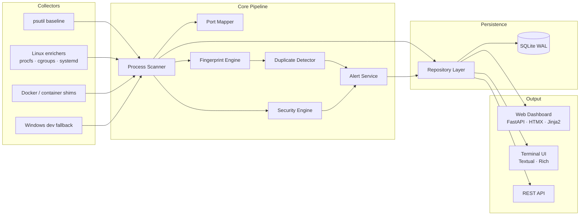
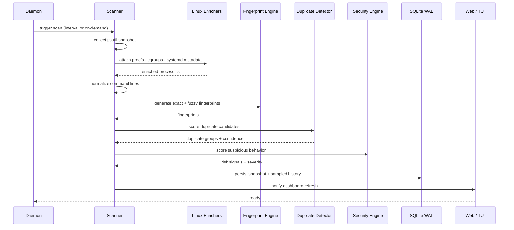
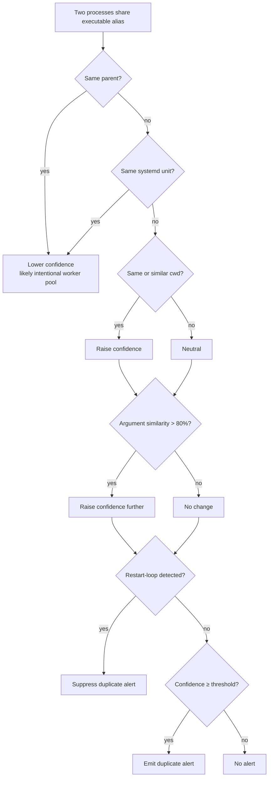
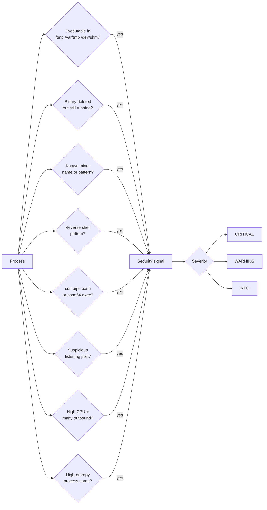
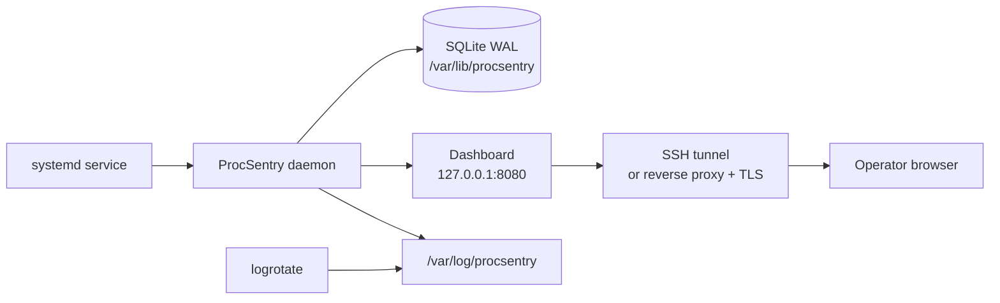

# ProcSentry

<div align="center">

### Lightweight process intelligence for Linux VPS operators

Find duplicate apps, suspicious processes, exposed ports, restart loops, and
resource-heavy services — without installing a giant monitoring stack.

<br>

[](#project-status)
[](https://www.python.org/)
[](https://fastapi.tiangolo.com/)
[](#performance-philosophy)
[](#linux-first-design)
[](#dashboard-overview)
[](#license)

<br>

```text
processes → fingerprints → duplicate intelligence → alerts → dashboard / TUI
```

</div>

---

## What Is ProcSentry?

ProcSentry is a **Linux-first VPS observability tool** focused on process intelligence. It helps answer practical server questions without requiring a full metrics stack:

| Question | ProcSentry feature |
|---|---|
| Why is my VPS slow? | CPU / RAM process tracking |
| Did I accidentally start the same app twice? | Duplicate process detection |
| What is listening on this port? | Port-to-process mapping |
| Is this process suspicious? | Lightweight security heuristics |
| Is this process managed or manual? | systemd / cgroup / container hints |
| Did this service keep restarting? | Restart-count and restart-loop signals |

> **Project status:** deployable alpha. Suitable for real Ubuntu / Debian VPS validation. Keep the dashboard local or protected, and review findings manually before acting.

---

## Architecture

### Component Flow



### Scan Sequence



### Component Map

| Component | Path | Role |
|---|---|---|
| psutil baseline | `app/collectors/psutil_collector.py` | Cross-platform process snapshot |
| Linux enrichers | `app/collectors/procfs.py` · `systemd.py` · `docker.py` | procfs, cgroups, container, zombie, deleted-exe |
| Windows fallback | `app/collectors/` | Safe dev-mode degradation |
| Fingerprint engine | `app/core/fingerprint.py` | Exact + fuzzy process fingerprints |
| Duplicate detector | `app/core/duplicate_detector.py` | Scoring, worker exclusions, restart-loop suppression |
| Security engine | `app/core/security_engine.py` | Suspicious process scoring |
| Port mapper | `app/core/port_mapper.py` | Listening TCP / UDP → owning PID |
| Scanner | `app/core/scanner.py` | Orchestrates the full pipeline |
| Repository | `app/database/repository.py` | SQLite persistence, retention, WAL maintenance |
| Web dashboard | `app/web/` | FastAPI + HTMX routes |
| Terminal UI | `app/tui/` | Textual / Rich live view |
| Alert service | `app/services/alert_service.py` | Alert lifecycle and acknowledgements |

---

## Feature Highlights

| Area | Capabilities |
|---|---|
| Process monitoring | PID, PPID, command, cwd, executable, user, CPU, RAM, threads, status |
| Duplicate intelligence | Exact / fuzzy detection, confidence scoring, structured reasoning |
| Low false positives | Worker-aware exclusions for gunicorn, celery, nginx, postgres, pm2, uvicorn reload, node clusters, docker shims |
| Linux intelligence | procfs, cgroups, systemd units, containers, deleted executables, zombies, orphans |
| Port mapping | Listening TCP / UDP ports mapped to owning processes |
| Suspicious process detection | Temp executables, deleted binaries, miner patterns, reverse-shell patterns, suspicious ports |
| Restart awareness | PID reuse and restart counters |
| Runtime observability | Scan timing, cache stats, DB size, capability state |
| Web dashboard | FastAPI, HTMX, Jinja2, Tailwind |
| Terminal UI | Textual / Rich live process view |
| Platform-aware collectors | Linux production collectors, Windows-safe development fallback |

---

## Install

### Ubuntu / Debian

```bash
sudo apt-get update
sudo apt-get install -y python3.12 python3.12-venv sqlite3

git clone https://github.com/your-org/procsentry.git
cd procsentry

python3.12 -m venv .venv
. .venv/bin/activate
pip install -e ".[dev]"

procsentry --config config/procsentry.yml scan-once
```

### Run the web dashboard

```bash
procsentry --config config/procsentry.yml web
# open http://127.0.0.1:8080
```

### Run the terminal UI

```bash
procsentry --config config/procsentry.yml tui
```

### Run as a daemon

```bash
procsentry --config config/production.example.yml daemon
```

### Docker

```bash
docker compose up --build
```

Docker is useful for validation. For best host-process visibility on a VPS, a native systemd install is clearer.

### Development

```bash
python -m venv .venv
. .venv/bin/activate
pip install -e ".[dev]"
python -m pytest
```

Windows development is supported for the UI, API, database layer, and detection logic. Linux-only process intelligence degrades safely.

---

## Quick Start

```bash
# one scan
procsentry --config config/procsentry.yml scan-once

# benchmark scanner overhead
python scripts/benchmark_scan.py --iterations 20 --sleep 1

# health checks
curl http://127.0.0.1:8080/health
curl http://127.0.0.1:8080/metrics
curl http://127.0.0.1:8080/capabilities

# access a remote VPS dashboard safely
ssh -L 8080:127.0.0.1:8080 root@your-vps
```

---

## Dashboard Overview

| Page | Purpose |
|---|---|
| `/` | Overview, top processes, recent alerts |
| `/processes` | Searchable process explorer |
| `/processes/{pid}` | Process detail, ports, ancestry, notes, risk signals |
| `/duplicates` | Duplicate review workflow |
| `/suspicious` | Suspicious process review |
| `/ports` | Port exposure analysis |
| `/alerts` | Alert timeline and acknowledgements |
| `/capabilities/view` | Runtime capability overview |

**Keyboard shortcuts**

| Key | Action |
|---|---|
| `p` | Processes |
| `d` | Duplicates |
| `a` | Alerts |

---

## REST API

| Endpoint | Purpose |
|---|---|
| `GET /health` | Basic health |
| `GET /health/score` | Degraded-mode score |
| `GET /metrics` | Runtime, scan, DB, and host metrics |
| `GET /stats` | Process, duplicate, alert counts |
| `GET /capabilities` | Runtime capability flags |
| `GET /api/processes` | Paginated process list |
| `GET /api/processes/{pid}` | Process detail |
| `GET /api/duplicates` | Duplicate groups |
| `GET /api/ports` | Port map |
| `GET /api/alerts` | Active alerts |

---

## Duplicate Detection

ProcSentry combines normalized fingerprints with weighted scoring to surface accidental duplicates without flooding the operator with false positives.



| Signal | Effect |
|---|---|
| Same executable alias | Raises confidence |
| Same or similar cwd | Raises confidence |
| Argument similarity | Raises confidence |
| Same application entrypoint | Raises confidence |
| Same parent | Lowers confidence |
| Parent-child ancestry | Lowers confidence |
| Same systemd unit | Lowers confidence |
| Different containers | Lowers confidence |
| Restart-loop behavior | Suppresses duplicate alerting |

**Worker pools excluded by default:** gunicorn, celery, nginx, postgres background workers, uvicorn --reload, node cluster workers, docker / containerd shim trees, pm2 clusters.

---

## Security Heuristics

ProcSentry is not an EDR. It provides practical VPS-focused signals:



Findings include severity, confidence score, and human-readable reasons.

---

## Linux-First Design

Linux is the production target. On Linux, ProcSentry can use:

| Source | Data |
|---|---|
| `/proc/<pid>/stat` | Zombie detection |
| `/proc/<pid>/exe` | Deleted executable detection |
| `/proc/<pid>/cgroup` | Cgroup and container attribution |
| cgroup metadata | systemd unit names |
| socket ownership | Port-to-process mapping |

Runtime capabilities are exposed through the API:

```bash
curl http://127.0.0.1:8080/capabilities
```

```json
{
  "system": "Linux",
  "supports_procfs": true,
  "supports_systemd": true,
  "supports_cgroups": true,
  "supports_deleted_exe": true,
  "supports_zombie_state": true
}
```

---

## Windows Development Mode

Windows is supported for development, not production monitoring.

| Feature | Windows |
|---|---|
| Dashboard development | ✅ |
| API development | ✅ |
| Database tests | ✅ |
| Duplicate detection tests | ✅ |
| Baseline psutil scanning | ✅ |
| procfs parsing | ❌ |
| cgroup / container mapping | ❌ |
| systemd correlation | ❌ |
| Linux deleted executable detection | ❌ |
| Linux zombie-state parsing | ❌ |

---

## Configuration

```yaml
scan_interval: 5
history_retention_days: 7
data_dir: ./data
database_url: sqlite:///./data/procsentry.db

web:
  host: 127.0.0.1
  port: 8080
  auth_enabled: false
  csrf_enabled: true

duplicate_detection:
  enabled: true
  confidence_threshold: 75
  suppression_window_seconds: 300

storage:
  history_sample_interval_seconds: 15
  maintenance_interval_seconds: 3600
```

**Environment overrides:**

```bash
PROCSENTRY_WEB__PORT=9090 procsentry web
PROCSENTRY_WEB__AUTH_ENABLED=true procsentry web
PROCSENTRY_DUPLICATE_DETECTION__CONFIDENCE_THRESHOLD=85 procsentry daemon
```

Production example: `config/production.example.yml`

---

## Deployment

Recommended production shape:



| File | Purpose |
|---|---|
| `systemd/procsentry.service` | systemd unit |
| `systemd/procsentry.logrotate` | Log rotation example |
| `scripts/install.sh` | Install helper |
| `scripts/backup.sh` | SQLite backup helper |
| `docs/deployment-linux.md` | Ubuntu / Debian deployment guide |

---

## Performance Philosophy

ProcSentry is designed for small servers. Key choices:

| Choice | Benefit |
|---|---|
| Bounded caches | Caps memory growth |
| Scan debounce for dashboard refreshes | Avoids redundant work |
| Cached fingerprints + executable hashes | Amortizes repeated computation |
| Sampled process history | Keeps DB small |
| SQLite WAL mode | Non-blocking concurrent reads |
| Retention pruning | Bounded disk usage |
| Stage-level scan timings | Identifies bottlenecks |
| Minimal frontend JavaScript | Fast page loads |

Benchmark output:

```text
scan_ms_first=...
scan_ms_warm_avg=...
cold_collect_ms=...
cold_ports_ms=...
cold_socket_enum_ms=...
cold_enrich_ms=...
cold_fingerprint_ms=...
rss_delta_mb=...
```

Benchmark on the actual VPS — Windows development numbers are not representative of Linux procfs performance.

---

## Security Notes

The dashboard binds to `127.0.0.1` by default. Do not expose it directly to the internet without protection.

**Recommended access patterns:**

1. SSH tunnel:
   ```bash
   ssh -L 8080:127.0.0.1:8080 root@your-vps
   ```
2. Reverse proxy with TLS and authentication.
3. Built-in auth for simple protected deployments (signed session cookies + CSRF protection).

ProcSentry treats process metadata as untrusted:

- Command lines are never executed
- Environment values are never executed
- Auto-healing is disabled by default
- Process termination requires OS-level permission

---

## Terminal UI

```bash
procsentry --config config/procsentry.yml tui
```

| Key | Action |
|---|---|
| `r` | Refresh |
| `/` | Toggle suspicious filter |
| `i` | Inspect selected process |
| `k` | Guarded kill action |
| `q` | Quit |

---

## Testing

```bash
python -m pytest
python -m ruff check app tests scripts
python -m mypy app
python -m compileall -q app tests scripts
```

Coverage includes:

| Area | Tests |
|---|---|
| Linux procfs / cgroup fixtures | `tests/test_linux_procfs_fixtures.py` |
| Realistic worker-pool scenarios | `tests/test_realistic_process_scenarios.py` |
| Duplicate false-positive cases | `tests/test_duplicate_detector.py` |
| Platform collector behavior | `tests/test_platform_collectors.py` |
| API and storage | `tests/test_api.py` · `tests/test_database.py` |
| Security heuristics | (security engine tests) |
| Fingerprint engine | `tests/test_fingerprint.py` |
| Port mapper | `tests/test_port_mapper.py` |
| Scanner cache metrics | `tests/test_scanner_cache_metrics.py` |

---

## Example Workflows

### Duplicate Review

```text
Duplicate group
Confidence: 94%

Reason:
  - same executable alias
  - same or highly similar cwd
  - 96% argument similarity
  - same application entrypoint

PIDs:
  1842  python3 /srv/bot/bot.py
  1910  python3 /srv/bot/bot.py
```

### Suspicious Process Review

```text
WARNING security / CRITICAL
PID 4242 (xmrig) looks suspicious:
  - known crypto miner process name
  - excessive CPU
  - temp directory executable
```

### Port Exposure Review

```text
0.0.0.0:8000    tcp    uvicorn    PID 1832
127.0.0.1:5432  tcp    postgres   PID 912
```

### Operator Notes

```text
tag: known
note: intentional blue/green overlap during deploy window
```

---

## Screenshots

| View | Path |
|---|---|
| Dashboard overview | `docs/screenshots/dashboard-overview.png` |
| Duplicate review | `docs/screenshots/duplicate-review.png` |
| Suspicious process review | `docs/screenshots/suspicious-processes.png` |
| Process detail | `docs/screenshots/process-detail.png` |
| Terminal UI | `docs/screenshots/terminal-ui.png` |

---

## Roadmap

Near-term focus:

- [ ] Linux VPS validation on real Ubuntu / Debian hosts
- [ ] Lower false positives
- [ ] Persistent duplicate allowlists
- [ ] Alert suppression across daemon restarts
- [ ] Process trend sparklines
- [ ] Dashboard polish
- [ ] Install and packaging hardening

Non-goals: Kubernetes orchestration · distributed monitoring · enterprise SaaS · React frontend · generic metrics sprawl.

---

## Contributing

Contributions are welcome, especially around:

- Linux VPS fixture coverage
- Duplicate detection edge cases
- False-positive reduction
- Dashboard clarity
- Deployment testing
- Low-overhead performance improvements

Before opening a PR:

```bash
python -m pytest
python -m ruff check app tests scripts
python -m mypy app
```

Please keep changes practical and aligned with the Linux VPS focus.

---

## License

License has not been finalized yet. Add a `LICENSE` file before publishing a tagged release.
